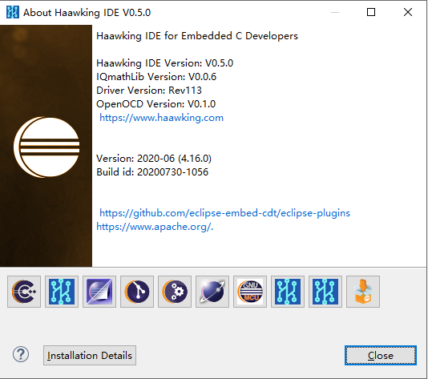

============
Haawking IDE
============

Haawking™ IDE now provides the RISC-V DSP development market with one toolset using a single debugger instance to program and debug any of Beijing Haakwing Technology Co., Ltd's RISC-V DSPs using JTAG or HX-LINK debug interfaces.

V0.5.0
============

Tutorials
============

中科昊芯Haawking IDE V0.0.8版功能演示，包括Flash密钥修改，RAM和Flash工程属性切换等。

https://www.bilibili.com/video/BV1qT4y1K7oB

中科昊芯IDE使用之如何导入已有工程，修改，重新编译，调试。

https://www.bilibili.com/video/BV1AU4y1W71f

中科昊芯DSC28034芯片及湖人板（Lakers）开箱、LED闪灯示例；片内Flash烧写等。

https://www.bilibili.com/video/BV14N411o77o

介绍一下Haawking IDE V0.5.2版本的更新内容，重点讲解一下如何通过新增的Spike模拟器来进行程序仿真和调试。

https://www.bilibili.com/video/BV1rV411j7VE
